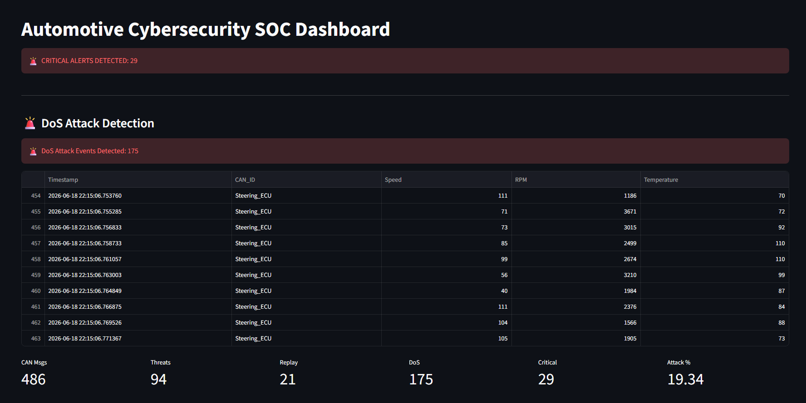

# Automotive Cybersecurity SOC Dashboard

A real-time Automotive Cybersecurity Monitoring Platform built using Python and Streamlit to simulate CAN Bus traffic, generate cyberattacks, detect malicious activities, and visualize security events through an SOC-style dashboard.

---

## Project Overview

Modern vehicles contain multiple Electronic Control Units (ECUs) communicating over the CAN Bus. This project simulates vehicle network traffic, injects cyberattacks, detects malicious behavior, and presents findings through a real-time Security Operations Center (SOC) dashboard.

---

## Features

- Multi-ECU CAN Bus Simulation
- Real-Time Vehicle Data Generation
- Speed Spoofing Detection
- RPM Manipulation Detection
- Replay Attack Detection
- DoS Attack Simulation
- DoS Attack Detection
- Threat Severity Classification
- Security Metrics Dashboard
- ECU Activity Monitoring
- Critical Alert Generation

---

## Architecture

```text
Vehicle ECUs
      │
      ▼
CAN Bus Traffic Simulation
      │
      ▼
Realtime Simulator
      │
      ▼
Vehicle Data Logs
      │
      ▼
Attack Detector
      │
      ├── Speed Spoofing
      ├── RPM Manipulation
      ├── Replay Attack
      └── DoS Flooding
      │
      ▼
Detected Attacks
      │
      ▼
Streamlit SOC Dashboard
      │
      ├── KPI Cards
      ├── Critical Alerts
      ├── ECU Analytics
      ├── Replay Detection
      └── DoS Monitoring
```

---

## Attack Types Simulated

| Attack | Description |
|----------|-------------|
| Speed Spoofing | Injecting unrealistic vehicle speed values |
| RPM Manipulation | Modifying engine RPM readings |
| Replay Attack | Re-sending previously captured CAN messages |
| DoS Flooding | Flooding the CAN network with excessive messages |

---

## Technologies Used

- Python
- Streamlit
- Pandas
- Matplotlib

---

## How to Run


pip install -r requirements.txt
python realtime_simulator.py
python -m streamlit run dashboard.py


---

## Screenshots

### Dashboard Overview



### Attack Detection


### vehicle_speed_analysis


### Attacks_&_ECU_traffic_distribution


---


## Author

Sivateja B

B.Tech CSE (Cybersecurity)